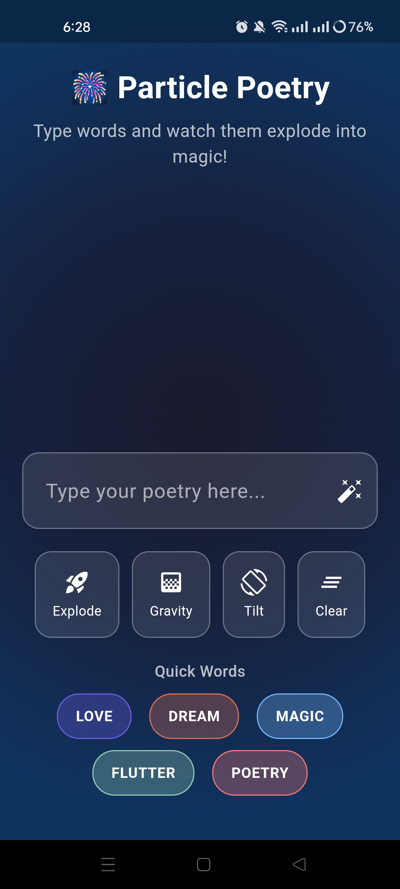
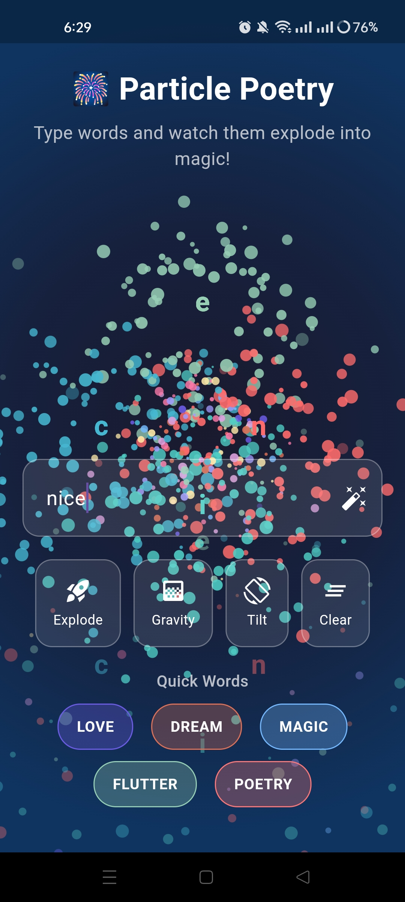
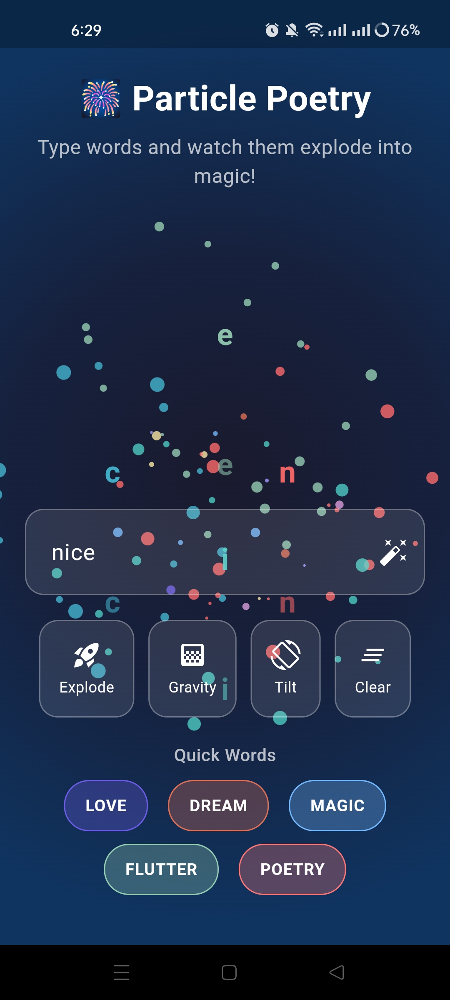

# ✨ Particle Poetry Generator

[](https://flutter.dev)
[](https://dart.dev)
[]()
[]()
[](https://opensource.org/)

---

## 🎨 Overview

**Particle Poetry Generator** is an **innovative Flutter application** that transforms your text into **stunning visual art** — featuring explosive particle effects, interactive letter animations, and the perfect blend of creativity and technology.

This project serves as an **inspiring showcase** for developers exploring advanced Flutter particle systems, custom painters, and creating magical user experiences where words literally come alive before your eyes.

---

## 🎬 Preview

<div align="center">
  
  
  *Transform words into mesmerizing particle art*
  <video src="https://github.com/user-attachments/assets/your-video-id" controls width="100%" ></video>

    
</div>


---

## ✨ Features

### 🎆 **Particle Effects**
* 💥 **Text Explosion** — Watch your words burst into beautiful particles
* 🎭 **Interactive Letters** — Each character becomes a living, animated particle
* ✨ **Real-time Animation** — Smooth and responsive particle physics

### 🎨 **Stunning Visuals**
* 🌈 **Visual Poetry** — Transform text into captivating artistic displays
* 💫 **Dynamic Particles** — Interactive elements that respond to your input
* 🎪 **Creative Canvas** — Turn simple words into extraordinary visual experiences
* 📱 **Immersive Design** — Full-screen particle simulations

### 🚀 **User Experience**
* ⌨️ **Simple Input** — Type your text and watch the magic happen
* 🎯 **Instant Results** — Immediate visual feedback and transformations
* 🎨 **Creative Freedom** — Express yourself through particle poetry

---

## 📸 Screenshots

<div align="left">
  <table>
    <tr>
      <td></td>
      <td></td>
      <td></td>
      <td></td>
    </tr>
  </table>
</div>

---

## 🎥 Demo Video

Watch the **Particle Poetry Generator** in action:
<div align="center">
<video src="https://github.com/user-attachments/assets/your-demo-video-id" controls width="100%" ></video> 
</div>


---

## 🏗️ Tech Stack

| Technology                          | Description                                          |
| ----------------------------------- | ---------------------------------------------------- |
| **Flutter**                         | Cross-platform framework for building beautiful apps |
| **Dart**                            | Core programming language powering Flutter apps      |
| **CustomPainter**                   | Advanced canvas rendering for particle effects       |
| **Animation Controllers**           | Smooth and responsive particle animations            |

---

## ⚙️ Installation & Setup

Follow these steps to run the project locally:

### 1️⃣ Clone the Repository

```bash
git clone https://github.com/<your-username>/particle-poetry-generator.git
cd particle-poetry-generator
```

### 2️⃣ Install Dependencies

```bash
flutter pub get
```

### 3️⃣ Run the App

```bash
flutter run
```

---

## 💡 Learning Outcomes

By working with this project, you'll gain insights into:

* 🎨 **Particle Systems** — Creating interactive particle effects in Flutter
* 💫 **Custom Painting** — Mastering CustomPainter for advanced graphics
* ✨ **Animation Techniques** — Building smooth and responsive animations
* 🎯 **Physics Simulation** — Implementing particle physics and behaviors
* 🎭 **Creative Coding** — Combining art and technology for unique experiences


---

## 🤝 Contributing

Contributions are encouraged! If you'd like to enhance the design or functionality:

1. Fork the repository
2. Create a new branch (`git checkout -b feature/your-feature`)
3. Commit your changes (`git commit -m 'Add a new feature'`)
4. Push to the branch (`git push origin feature/your-feature`)
5. Open a Pull Request

---
🧠 Flutter Development Environment Setup

This project is built using Flutter. Below are the essential details and configuration requirements for replicating the development environment.

| Component              | Details                                      |
| ---------------------- | -------------------------------------------- |
| **Flutter Version**    | 3.27.1 (Stable Channel)                      |
| **Framework Revision** | 17025dd882                                   |
| **Engine Revision**    | cb4b5fff73                                   |
| **Dart Version**       | 3.6.0                                        |
| **DevTools Version**   | 2.40.2                                       |
| **Operating System**   | Windows 10 (Version 10.0.26200.6725, 64-bit) |
| **Locale**             | en-US                                        |


💻 Android Studio

* Version: 2023.3
* Java Runtime: OpenJDK 17 (17.0.10+0--11572160)

---

## 🤝 Contributing

Contributions are highly encouraged! Here's how you can help:

1. 🍴 **Fork** the repository
2. 🌿 **Create** a new branch (`git checkout -b feature/amazing-feature`)
3. 💾 **Commit** your changes (`git commit -m 'Add amazing feature'`)
4. 📤 **Push** to the branch (`git push origin feature/amazing-feature`)
5. 🎉 **Open** a Pull Request

---

## 💬 Connect & Support

For questions, feedback, or collaborations:

<div align="center">

[](https://github.com/PHom798)
[](https://x.com/KishanP07684084)
[](https://www.linkedin.com/in/hom-bdr-pathak-01a3bb210)
[](pathakhom17@gmail.com)

</div>

---

## 🌟 Show Your Support

If this project helped you or inspired your work:

<div align="center">

⭐ **Star this repository**  
🍴 **Fork it for your projects**  
📢 **Share with the Flutter community**  
💖 **Sponsor the development**  
🐛 **Report issues or suggest features**

</div>

---

## 📊 Project Stats

<div align="center">


</div>

---

<div align="center">

**Made with ❤️, Flutter, and ✨**

*Where creativity meets technology*

### ✨ *"Words That Come Alive"* 💫

</div>
